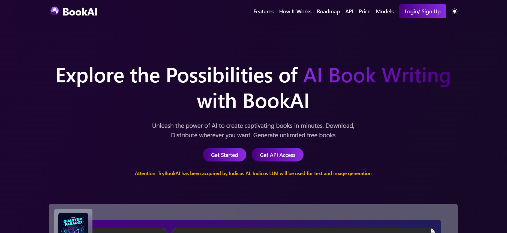

# Book Edge Evolve

Book Edge Evolve is an assignment project focused on enhancing a website using modern web development technologies. The project showcases a sleek, responsive design with features like dark and light mode, and smooth animations.

## Technologies Used

- **React:** A JavaScript library for building user interfaces.
- **Vite:** A fast build tool for modern web projects.
- **Tailwind CSS:** A utility-first CSS framework for rapid UI development.
- **TypeScript:** A strongly typed programming language that builds on JavaScript.
- **React Icons:** A popular icon library for React applications.
- **AOS (Animate on Scroll):** A library to animate elements on your page as you scroll.
- **Swiper:** A modern touch slider for mobile and web.

## Features

- **Dark and Light Mode:** Seamlessly switch between dark and light themes.
- **Responsive and Modern Design:** Adapts to all screen sizes with a contemporary look.
- **Animation:** Smooth animations to enhance user experience.

## How to Install and Run Locally

This project is built using Vite and React. Follow the steps below to run it locally:

1. Clone the repository:
   ```bash
   git clone https://github.com/amankashyap004/book-edge-evolve.git
   ```
2. Navigate to the project directory:
   ```bash
   cd book-edge-evolve
   ```
3. Install dependencies:
   ```bash
   npm install
   ```
4. Start the development server:
   ```bash
   npm run dev
   ```
5. Open your browser and go to `http://localhost:5173` to see the application in action.

## Screenshots

A sleek and modern homepage design showcasing.



## Live Demo and Repository

- Live Demo: **[Book Edge Evolve](https://book-edge-evolve.vercel.app/)**
- GitHub Repository: **[Book Edge Evolve](https://github.com/amankashyap004/book-edge-evolve/)**

## Folder Structure

The project is organized as follows:

```base
BOOK-EDGE-EVOLVE/
├── node_modules/
├── public/
│   ├── favicon.ico
│   └── screenshot.png
├── src/
│   ├── assets/
│   │   └── images/
│   ├── components/
│   │   ├── context/
│   │   │   └── ThemeProvider.tsx
│   │   ├── home/
│   │   │   ├── ContactUs.tsx
│   │   │   ├── FeaturePost.tsx
│   │   │   ├── Features.tsx
│   │   │   ├── HeroSection.tsx
│   │   │   ├── HomePage.tsx
│   │   │   ├── PricingSection.tsx
│   │   │   └── Testimonials.tsx
│   │   ├── ui/
│   │   │   └── Button.tsx
│   │   ├── Footer.tsx
│   │   ├── Header.tsx
│   │   └── ThemeToggleButton.tsx
│   ├── App.css
│   ├── App.tsx
│   ├── index.css
│   ├── main.tsx
│   └── vite-env.d.ts
├── .gitignore
├── eslint.config.js
├── index.html
├── package-lock.json
├── package.json
├── postcss.config.js
├── README.md
├── tailwind.config.js
├── tsconfig.app.json
├── tsconfig.json
├── tsconfig.node.json
└── vite.config.ts
```

## Future Enhancements

- Better Color Combination: Enhance the design with a more appealing color palette.
- More Sections: Add additional content sections to the homepage.
- Multipage: Expand the website into a multi-page application.
- Blog Page: Introduce a blog section to share articles and updates.
- More Animation: Add further animations for an enriched user experience.

Feel free to contact me for any queries or suggestions.
